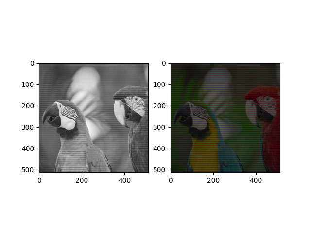
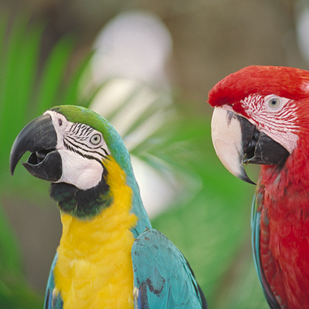
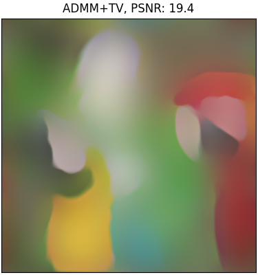

# Hyperspectral Image Reconstruction - CSC2529 Project

## Simulated Images

To simulated an image (using included RGB image as a hyperspectral image stand
        in)

    python amatrix.py

This uses the image formation matrix A in Afun and its transpose Atfun to sample
rows from each of the channels of the source image, to simulate capture of each
channel using a rolling shutter.

## Reconstruction using ADMM with TV prior

    python main.py

This runs ADMM using the total variation (TV) prior (can select anisotropic or isotropic).

Original Image             | Reconstructed Image
:-------------------------:|:-------------------------:
             |  

